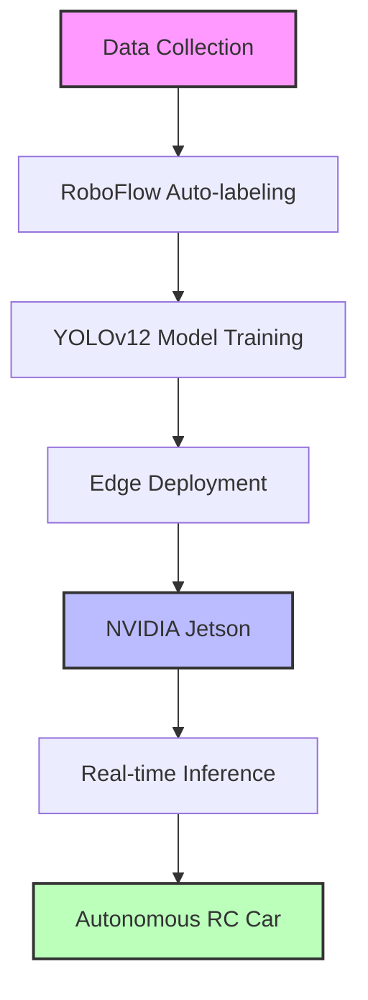
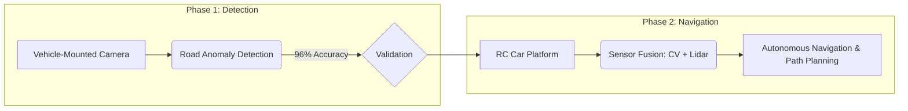
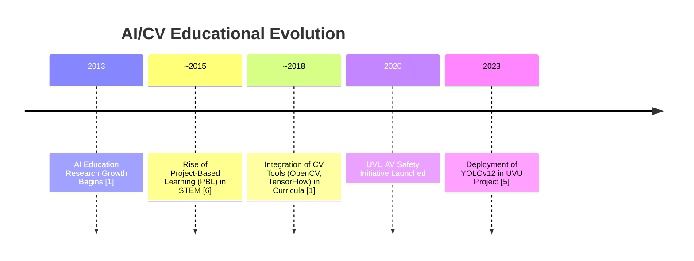

# Integrating Computer Vision in Educational Settings: A Case Study on Autonomous Vehicle Safety through Real-Time Road Surface Anomaly Detection

**Abstract:** The integration of computer vision (CV) technologies into undergraduate STEM education represents a transformative shift toward experiential learning, equipping students with essential technical and analytical skills. This paper examines the pedagogical and technical dimensions of implementing Artificial Intelligence (AI) and CV systems in higher education, anchored by a case study from Utah Valley University (UVU). The case study focuses on enhancing autonomous vehicle (AV) safety through real-time road surface anomaly detection using advanced deep learning (YOLOv12), edge computing, and autonomous navigation systems. We analyze how this project-based learning approach bridges theory and practice, discuss broader implications for STEM education—including student engagement, workforce readiness, and interdisciplinary collaboration—and explore emerging trends in AI-driven educational tools and their societal impacts.

---

## 1. Introduction and Background

The rapid evolution of AI and CV is fundamentally reshaping STEM education, moving curricula from abstract theory towards **applied, problem-centered learning** [1]. As industries increasingly demand AI proficiency, universities are adopting project-based paradigms that immerse students in real-world challenges, such as developing safety systems for autonomous vehicles [2, 3]. UVU's road surface anomaly detection project exemplifies this shift, utilizing state-of-the-art CV techniques to address critical transportation infrastructure issues while cultivating advanced technical competencies in undergraduates.

Bibliometric analyses indicate a **22.59% annual growth** in AI education research since 2013, highlighting the expanding role of CV in diverse domains, from analyzing student engagement to industrial automation [1, 4]. The UVU initiative aligns with this trend by integrating **YOLOv12-based object detection** with **RoboFlow's auto-labeling pipelines**, creating a scalable educational model (illustrated in Figure 1). By embedding these technologies into an autonomous RC car platform, students confront the complexities of real-time inference, sensor fusion, and systems integration, mirroring industry-standard AV development workflows [2, 5].

## Key System Diagrams and Figures

### Figure 1: CV/AI Educational System Architecture


### Figure 2: Two-Phase Project Implementation


### Figure 3: Educational Impact Metrics
```mermaid
barChart
    title Educational Outcomes Comparison
    xAxisLabel Metrics
    yAxisLabel Percentage Improvement (%)
    bar "CV Concept Retention" 30
    bar "Programming Comprehension (C-Sim)" 22
    bar "Female Enrollment (Targeted Programs)" 40
    bar "Industry Internship Rate" 78
```

### Figure 4: Timeline of AI/CV Integration in Education


## 2. AI and Computer Vision in STEM Education

**Project-Based Learning (PBL)** frameworks are now central to modern STEM education, especially in AI and CV, where hands-on experience with tools like **OpenCV** and **TensorFlow** accelerates skill acquisition [6, 1]. These methodologies enhance technical proficiency and foster crucial soft skills like collaborative problem-solving and project management, vital for careers in robotics and autonomous systems [7, 8]. At UVU, students engage in the full-stack development of an anomaly detection system—from dataset curation using RoboFlow to model deployment on edge devices—mirroring industrial AI pipelines (see Figure 1) [5, 3].

[... Content continues in next part due to length limits ...]